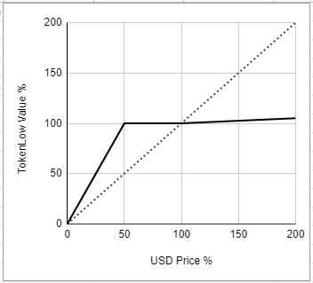
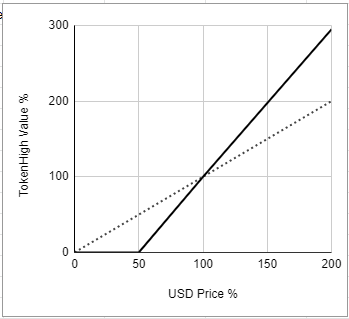

Contracts
- Factory contract that creates the pair
- THigh, TLow Tokens
- Pair contract that issues THigh and TLow
- Pair contract that repays THigh and TLow
- The only unknown is the ClosePrice which determines how everything is paid out

Token chop allows a token to be split into two new tokens with different risk and reward profiles.
Tokens are split into two new tokens THigh and TLow. 
THigh takes the first 50% of any value loss, TLow does not suffer any loss in value until THigh is gone.

The risk reward is assessed relative to a price symbol.
A token is transferred to the pair contract

change = p1/p0
Formula is determed by max(x/slicepoint - 1, 0) * x - fee * max(x-1,0)

Fee (F) determines profit split (PS). If positive it is taken from High and given to Low.
Starting Price (P0)
Closing Price (P1)
Starting Tokens (T0)
Closing Tokens (T1)
Change (C) is defined by P1/P0.
RebalancedPercentage (RP) is the multiplier of the original amount to resolve amy movements in price. This is as a P0 price
Slice point (SP) is the change at which losses affect Low

RP = MAX(C/SP-1,0)
PS = F * MAX(C - 1, 0)
T1 = T0 * RebalanceFn(C) / C

RebalanceFn = PS + RP

The new tokens can be tradable and underpinned by the asset in the smart contract
The effect of a margin loan is acheived with the HighPart, these tokens could be resplit for additional leverage
No counterparty risk.

Market functions

Axioms
People want to buy at the best price
There must be a buyer and seller for a sale
A market order should execute
spread is the difference between the highest buyer and the lowest sell
Low part is the seller they want the highest fee
High part is the buyer they want the lowest fee
Limit orders say what the least good price will be accepted. A limit order above the market price is just a market order.

Spread: The difference between the highest seller and the lowest buyer

1 2 3 4 5 6

Use events to determine what is going on with the contracts

Deposit to contract

AskLowToken(send the tokens?, Limit order true or false)
BidHighToken(sendthetoken?, Limit order)
CancelAsk(Amount)
CancelBid(Amount)

how do you send erc tokens as part of a transaction

https://www.investopedia.com/terms/b/bid-and-ask.asp
The term bid and ask (also known as bid and offer) refers to a two-way price quotation that indicates the best potential price at which a security can be sold and bought at a given point in time. The bid price represents the maximum price that a buyer is willing to pay for a share of stock or other security. The ask price represents the minimum price that a seller is willing to take for that same security.

On the UI place order/limit. this approves token transfer and sends message to the router.
router finds a contract that matches. calls transfer for the people.
puts the funds into the contract. must handle error where funds don't show up.

need something incase they transfer to token or contract

earn 0.1 fee

- As a user I want to be able to see the tokens on offer
- I want to be able to buy high a token
- I want to be able to buy a low token
- I want to get the right money back when it is over

- I need to connect either my metamask or binance chain waller

token chop splits the funds into two tokens. basically the high token will cover any loss of value for the low until their funds are gone. the high token gets all the gain from the low token.

newrequirement = P0/P1 times current balance

